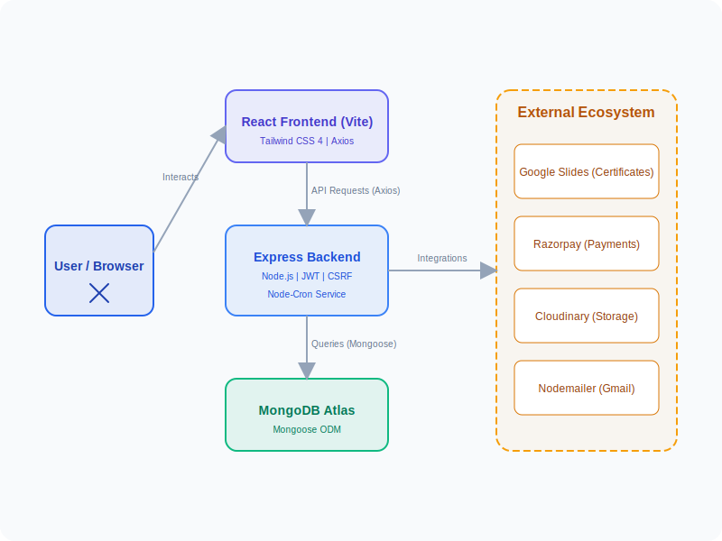

<h1 style="color:#2563eb;">🚀 Code a Nova — Internship Management Platform</h1>

<p>
A professional, full-stack <b>MERN</b> internship platform designed to automate student onboarding, project tracking, 
and credential issuance. Built with <b>React 19</b> and <b>Node.js</b>, Code a Nova streamlines the entire intern lifecycle—from application 
to the generation of dynamic <b>Offer Letters</b> and <b>Completion Certificates</b> via Google Slides integration.
</p>

<hr>

<h2 style="color:#7c3aed;">📑 Table of Contents</h2>

<ul>
<li>🌟 <a href="#what-is-code-a-nova">What is Code a Nova</a></li>
<li>👥 <a href="#user-roles">User Roles & Dashboards</a></li>
<li>✨ <a href="#key-features">Key Features</a></li>
<li>💻 <a href="#tech-stack">Tech Stack</a></li>
<li>📂 <a href="#project-structure">Project Structure</a></li>
<li>🚀 <a href="#installation">Getting Started (Local Setup)</a></li>
<li>🔑 <a href="#environment-variables">Environment Variables</a></li>
<li>🌐 <a href="#api-endpoints">API Routes Summary</a></li>
<li>⏰ <a href="#automation">Automations & Cron Jobs</a></li>
<li>📜 <a href="#available-scripts">Available Scripts</a></li>
</ul>

<hr>

<h2 id="what-is-code-a-nova" style="color:#10b981;">🌟 What is Code a Nova</h2>

<p>
<b>Code a Nova</b> is a centralized internship ecosystem that provides a seamless experience for both students and administrators. 
The platform handles the complexity of managing multiple intern batches, tracking project submissions across months, 
processing security deposit payments, and instantly generating verified professional documents.
</p>

<p align="center">
  
</p>

<p><b>A student can use Code a Nova to:</b></p>
<ul>
<li>📝 Register and apply for specific internship domains (Web Dev, App Dev, UI/UX, etc.)</li>
<li>💳 Pay security deposits securely via <b>Razorpay</b></li>
<li>📊 Access a personalized <b>Student Dashboard</b> to track internship progress</li>
<li>📅 Unlock monthly project tasks based on their start date</li>
<li>📂 Submit GitHub repositories and live links for review</li>
<li>📄 Download official <b>Offer Letters</b> and <b>Internship Certificates</b> on-demand</li>
<li>🛡️ Verify certificate authenticity via a public verification portal</li>
</ul>

<hr>

<h2 id="user-roles" style="color:#f59e0b;">👥 User Roles & Dashboards</h2>

<table style="border-collapse: collapse; width:100%; text-align:left;">
<thead>
<tr style="background-color:#f8f9fa;">
<th style="border:1px solid #ddd; padding:10px;">Role</th>
<th style="border:1px solid #ddd; padding:10px;">Responsibilities & Access</th>
</tr>
</thead>
<tbody>
<tr>
<td style="border:1px solid #ddd; padding:10px;">🎓 Student</td>
<td style="border:1px solid #ddd; padding:10px;">
Profile management, project submissions, payment tracking, document downloads.
</td>
</tr>
<tr>
<td style="border:1px solid #ddd; padding:10px;">🛠️ Admin</td>
<td style="border:1px solid #ddd; padding:10px;">
Analytics dashboard, student verification, batch assignment, project review, bulk certificate issuance, broadcast announcements, Excel data management.
</td>
</tr>
<tr>
<td style="border:1px solid #ddd; padding:10px;">🔍 Public</td>
<td style="border:1px solid #ddd; padding:10px;">
Certificate verification via unique Certificate ID, on-demand PDF generation.
</td>
</tr>
</tbody>
</table>

<hr>

<h2 id="key-features" style="color:#ef4444;">✨ Key Features</h2>

<h3 style="color:#3b82f6;">🔐 1. Authentication & Security</h3>
<ul>
<li>JWT (JSON Web Token) based authentication for secure sessions.</li>
<li>Role-based Access Control (RBAC) ensuring students and admins have appropriate permissions.</li>
<li>Bcrypt hashing for secure password storage.</li>
</ul>

<h3 style="color:#3b82f6;">🎓 2. Student Lifecycle Management</h3>
<ul>
<li><b>Automated Student ID Generation</b>: Unique IDs generated for every registrant.</li>
<li><b>Batch Assignment</b>: Admins can group students into specific monthly batches.</li>
<li><b>Offer Letter Automation</b>: Dynamic PDF generation via Google Slides with personal details.</li>
</ul>

<h3 style="color:#3b82f6;">📂 3. Project & Task Engine</h3>
<ul>
<li><b>Monthly Task Unlocking</b>: Tasks for Month 2 and Month 3 unlock based on the student's start date.</li>
<li><b>Submission Link Integration</b>: Direct submission of repository and deployment URLs.</li>
<li><b>Automated Reminders</b>: Scheduled emails for upcoming task deadlines.</li>
</ul>

<h3 style="color:#3b82f6;">👑 4. Advanced Admin Control Panel</h3>
<ul>
<li><b>Global Analytics</b>: Real-time count of total users, projects, and payments.</li>
<li><b>Broadcast System</b>: Instant platform-wide announcements.</li>
<li><b>Manual Overrides</b>: Admin can manually toggle payment status or document availability.</li>
<li><b>Bulk Operations</b>: Import/Export students via Excel (`.xlsx`).</li>
</ul>

<h3 style="color:#3b82f6;">💳 5. Financial & Document Integration</h3>
<ul>
<li><b>Razorpay Payment Gateway</b>: Secure payment of security deposits with automated status updates.</li>
<li><b>Google Slides API</b>: Generates professional certificates on the fly without storing massive PDF files.</li>
<li><b>Public Verification Registry</b>: Trusted portal for third parties to verify intern credentials.</li>
</ul>

<hr>

<h2 id="tech-stack" style="color:#6366f1;">💻 Tech Stack</h2>

<h3 style="color:#8b5cf6;">⚙️ Backend (Node.js & Express)</h3>
<table style="border-collapse:collapse;width:100%;text-align:left;">
<thead>
<tr style="background:#f8f9fa;">
<th style="border:1px solid #ddd;padding:10px;">Technology</th>
<th style="border:1px solid #ddd;padding:10px;">Purpose</th>
</tr>
</thead>
<tbody>
<tr>
<td style="border:1px solid #ddd;padding:10px;">Express 5.2.1</td>
<td style="border:1px solid #ddd;padding:10px;">High-performance routing and middleware management.</td>
</tr>
<tr>
<td style="border:1px solid #ddd;padding:10px;">MongoDB & Mongoose</td>
<td style="border:1px solid #ddd;padding:10px;">Scalable NoSQL database with strict schema modeling.</td>
</tr>
<tr>
<td style="border:1px solid #ddd;padding:10px;">Google APIs</td>
<td style="border:1px solid #ddd;padding:10px;">Slides/Drive API for dynamic document generation.</td>
</tr>
<tr>
<td style="border:1px solid #ddd;padding:10px;">Razorpay</td>
<td style="border:1px solid #ddd;padding:10px;">Integrated payment gateway for internship deposits.</td>
</tr>
<tr>
<td style="border:1px solid #ddd;padding:10px;">Nodemailer</td>
<td style="border:1px solid #ddd;padding:10px;">SMTP-based automated email notifications and reminders.</td>
</tr>
<tr>
<td style="border:1px solid #ddd;padding:10px;">Cloudinary</td>
<td style="border:1px solid #ddd;padding:10px;">Optimized cloud storage for student profile images.</td>
</tr>
<tr>
<td style="border:1px solid #ddd;padding:10px;">Node-Cron</td>
<td style="border:1px solid #ddd;padding:10px;">Task scheduling for automated project reminders.</td>
</tr>
</tbody>
</table>

<h3 style="color:#8b5cf6;">🎨 Frontend (React & Vite)</h3>
<table style="border-collapse:collapse;width:100%;text-align:left;">
<thead>
<tr style="background:#f8f9fa;">
<th style="border:1px solid #ddd;padding:10px;">Technology</th>
<th style="border:1px solid #ddd;padding:10px;">Purpose</th>
</tr>
</thead>
<tbody>
<tr>
<td style="border:1px solid #ddd;padding:10px;">React 19</td>
<td style="border:1px solid #ddd;padding:10px;">Modern component-based UI development.</td>
</tr>
<tr>
<td style="border:1px solid #ddd;padding:10px;">Vite 8</td>
<td style="border:1px solid #ddd;padding:10px;">Lightning-fast build tool and development server.</td>
</tr>
<tr>
<td style="border:1px solid #ddd;padding:10px;">Tailwind CSS 4</td>
<td style="border:1px solid #ddd;padding:10px;">Utility-first styling with modern CSS features.</td>
</tr>
<tr>
<td style="border:1px solid #ddd;padding:10px;">React Router 7</td>
<td style="border:1px solid #ddd;padding:10px;">Dynamic and efficient client-side navigation.</td>
</tr>
<tr>
<td style="border:1px solid #ddd;padding:10px;">React Hot Toast</td>
<td style="border:1px solid #ddd;padding:10px;">Crisp and beautiful notification system.</td>
</tr>
</tbody>
</table>

<hr>

<h2 id="project-structure" style="color:#8b5cf6;">📂 Project Structure</h2>

<pre>
CODE-A-NOVA/
├── backend/
│   ├── config/             # Database, Google API, Cloudinary configs
│   ├── controllers/        # Business logic for auth, admin, students, projects
│   ├── middleware/         # JWT and Role-based auth middleware
│   ├── models/             # Mongoose schemas (User, Project, Broadcast, etc.)
│   ├── routes/             # API route definitions
│   ├── utils/              # Email service, Google Slides logic, Cron jobs
│   └── server.js           # Entry point
├── frontend/
│   ├── public/             # Static assets
│   ├── src/
│   │   ├── components/     # UI components (Navbar, Footer, ProtectedRoutes)
│   │   ├── pages/          # Full-page views
│   │   ├── App.jsx         # Main router
│   │   └── config.js       # Base API configuration
│   └── vite.config.js
└── README.md
</pre>

<hr>

<h2 id="installation" style="color:#10b981;">🚀 Getting Started (Local Setup)</h2>

<h3 style="color:#3b82f6;">1. Clone and Install Dependencies</h3>
```bash
git clone https://github.com/username/code-a-nova.git
cd code-a-nova

# Install Backend Dependencies
cd backend
npm install

# Install Frontend Dependencies
cd ../frontend
npm install
```

<h3 style="color:#3b82f6;">2. Environment Setup</h3>

<p>Create a <b>.env</b> file in the <code>backend/</code> directory:</p>

```env
PORT=5005
MONGO_URI=your_mongodb_atlas_uri
JWT_SECRET=your_jwt_secret
EMAIL_USER=your_gmail_address
EMAIL_PASS=your_gmail_app_password
ADMIN_EMAIL=admin_email_for_dashboard
ADMIN_PASS=admin_password
RAZORPAY_KEY_ID=your_razorpay_id
RAZORPAY_KEY_SECRET=your_razorpay_secret
GOOGLE_TEMPLATE_ID=your_google_slides_template_id
GOOGLE_CREDENTIALS_PATH=./config/google-credentials.json
CLOUDINARY_CLOUD_NAME=your_cloud_name
CLOUDINARY_API_KEY=your_api_key
CLOUDINARY_API_SECRET=your_api_secret
```

<h3 style="color:#3b82f6;">3. Run the Application</h3>

```bash
# In backend directory
npm run dev

# In frontend directory
npm run dev
```

Visit the app at **http://localhost:5173**.

<hr>

<h2 id="api-endpoints" style="color:#3b82f6;">🌐 API Routes Summary</h2>

<table style="border-collapse:collapse;width:100%;text-align:left;">
<thead>
<tr style="background:#f8f9fa;">
<th style="border:1px solid #ddd;padding:10px;">Prefix</th>
<th style="border:1px solid #ddd;padding:10px;">Main Actions</th>
</tr>
</thead>
<tbody>
<tr>
<td style="border:1px solid #ddd;padding:10px;"><code>/api/auth</code></td>
<td style="border:1px solid #ddd;padding:10px;">Registration, OTP verification, login.</td>
</tr>
<tr>
<td style="border:1px solid #ddd;padding:10px;"><code>/api/admin</code></td>
<td style="border:1px solid #ddd;padding:10px;">Analytics, search, batch assignment, toggle documents.</td>
</tr>
<tr>
<td style="border:1px solid #ddd;padding:10px;"><code>/api/student</code></td>
<td style="border:1px solid #ddd;padding:10px;">Dashboard profile, profile picture upload.</td>
</tr>
<tr>
<td style="border:1px solid #ddd;padding:10px;"><code>/api/projects</code></td>
<td style="border:1px solid #ddd;padding:10px;">Task submission, Razorpay payment verification.</td>
</tr>
<tr>
<td style="border:1px solid #ddd;padding:10px;"><code>/api/public</code></td>
<td style="border:1px solid #ddd;padding:10px;">Certificate verification and on-demand download.</td>
</tr>
</tbody>
</table>

<hr>

<h2 id="automation" style="color:#ef4444;">⏰ Automations & Cron Jobs</h2>

<p>
The platform includes a <b>Cron Service</b> (<code>cronService.js</code>) that runs every day at 10 AM to:
</p>
<ul>
<li>Identify students whose timeline for Project #2 or #3 has started.</li>
<li>Send automated email reminders with submission links.</li>
<li>Ensure interns are engaged and aware of their monthly tasks.</li>
</ul>

<hr>

<h2 id="available-scripts" style="color:#7c3aed;">📜 Available Scripts</h2>

<h3 style="color:#6366f1;">Backend</h3>
<ul>
<li><code>npm start</code>: Production start.</li>
<li><code>npm run dev</code>: Development mode with Nodemon.</li>
<li><code>node check_db.js</code>: Utility to verify MongoDB connectivity.</li>
</ul>

<h3 style="color:#6366f1;">Frontend</h3>
<ul>
<li><code>npm run dev</code>: Start Vite in dev mode.</li>
<li><code>npm run build</code>: Production build.</li>
<li><code>npm run lint</code>: Code quality check.</li>
</ul>

<br>

<div style="border:1px solid #d0d7de;padding:25px;border-radius:12px;background-color:#f6f8fa;">
<h3 style="margin-top:0;color:#2563eb;">👥 Contributing</h3>
<p>
This project is open for technical collaborations and improvements. Feel free to fork the repository, create a branch, and submit a pull request!
</p>
</div>
